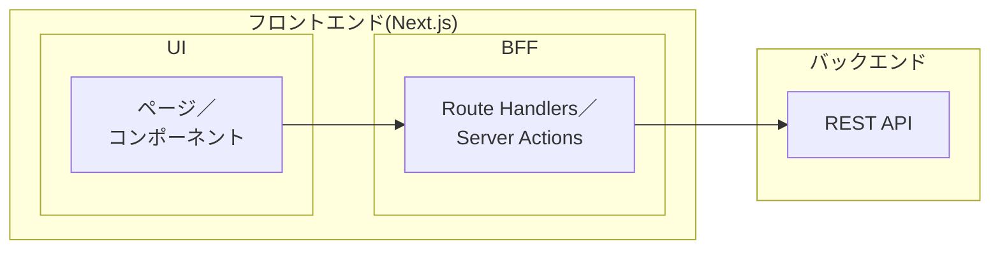
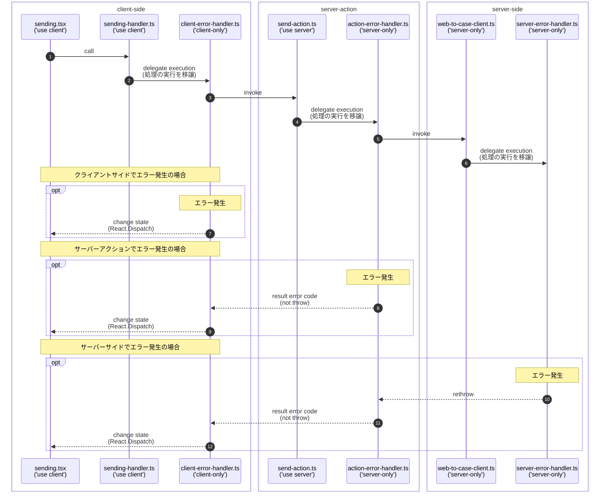

# ポートフォリオ
Next.js の実装集

## :open_book: 目次

1. [フロントエンドアーキテクチャ考察](#thinking-フロントエンドアーキテクチャ考察)
2. 簡単なアプリケーション
    * [対話型AIインターフェース](#robot-対話型AIインターフェース)
    * [お問い合わせフォーム](#envelope-お問い合わせフォーム)
4. アプリミドル基盤
    * [バリデーション](#heavy_check_mark-バリデーション)
    * [ロギング](#footprints-ロギング)
    * [エラーハンドリング](#boom-エラーハンドリング)
    * [ユーティリティ型](#hammer_and_wrench-ユーティリティ型)
    * [ページネーション](#books-ページネーション)
6. テスト＆モック
    * [node:test](#nodetest)
    * [next:jest](#nextjest)
    * [バックエンドAPIのモック](#バックエンドAPIのモック)

***

## :thinking: フロントエンドアーキテクチャ考察

ここで紹介する Next.js アプリケーションは、以下の設計に基づいて作っています。

* アプリケーションは、デカップルド・アーキテクチャ（decoupled architecture）におけるフロントエンドの位置付けとする。
* Route Handlers と Server Actions は BFF 層として位置付ける。
* バックエンド API は BFF 層から呼び出す方式とする。


	
* フロントエンドはMVVM構成とし、各構成要素であるModel、View、ViewModelを以下のように整理する。  

	* View  
  .tsxをViewとする。ページやコンポーネントのUIを実装する。
   
	* ViewModel  
  Viewに公開するもの(依存関係のあるもの)。Viewの状態や操作を実装する。

	* Model  
  Viewに依存しない処理。上記以外のものはすべてここに分類する。

	* 依存方向をView ⇒ ViewModel ⇒ Modelとする。

* フォルダ構成を以下とする。
```text
.
├── app                        コンポーネント(.tsx)を格納する。
│   ├── (system)               共通のView
│   ├── chat                   業務アプリのView
│   ├── contact                業務アプリのView
│   │
│   └── api                    Route Handlersを格納する。（※1）
│        ├── caht              業務アプリのRoute Handlers
│        └── contact           業務アプリのRoute Handlers
│
├── modules                    モジュール(.ts)を格納する。
│   ├── (system)               共通のモジュール
│   │
│   ├── chat                   業務アプリのモジュール
│   │   ├── models             業務アプリのモジュール(model)
│   │   └── view-models        業務アプリのモジュール(viewModel)
│   │
│   └── contact                業務アプリのモジュール
│        ├── models            業務アプリのモジュール(model)
│        └── view-models       業務アプリのモジュール(viewModel)
│
└── public
```
（※1）Route Handlers は制約上 `app/api` に置く必要があるため、ここはパススルーに留める。実質的な処理は別モジュールに切り出し、`modules/**/models` のフォルダに配置する。

:pencil: パススルーの実装例
```ts
// /app/api/contact/route.ts
import { handleRequest } from '@/modules/contact/models/contact-route';
export async function POST(req: Request): Promise<Response> {
　// 処理をパススルーする
  return handleRequest(req);
}

// /modules/contact/models/contact-route.ts
export async function handleRequest(req: Request): Promise<Response> {
  // 実質的な処理はこちらに記述する
  // ...
}
```

***

簡単なサンプルアプリケーション

## :robot: 対話型AIインターフェース

対話型AIに対して質問を入力すると、回答が一文字ずつリアルタイムに表示されます。  
対話型AIのAPIはモックを作成し、AIの回答を模した文字列を１文字ずつチャンク単位のストリーム形式でレスポンスしています。Next.jsのクライアントサイドでは、受信した文字列を順次差分レンダリングしています。

:open_file_folder: 画面サンプル：[_docs/chat/caht.gif](_docs/chat/caht.gif)  
:open_file_folder: コンポーネント：[app/chat/mvvm/](app/chat/mvvm)  
:open_file_folder: モジュール：[modules/chat/mvvm/](modules/chat/mvvm/),  [app/api/chat/](app/api/chat/)  
:open_file_folder: AIモック：[__mocks__/openai-mock.mts](__mocks__/openai-mock.mts)  
:open_file_folder: シーケンス図：[_docs/chat/sequenceDiagram.md](_docs/chat/sequenceDiagram.md)  

***

## :envelope: お問い合わせフォーム

入力されたお問い合わせをSalesforceのWeb-to-Caseに送信します。  

useReducerを使用し、状態管理ロジックをreducer関数としてモデルに分離することで、UIとモデルを切り分けています。MVVM（Model-View-ViewModel）パターンに基づいた構成のわかりやすい例だと思います。

:open_file_folder: 画面サンプル：[_docs/contact/contact.gif](_docs/contact/contact.gif)  
:open_file_folder: コンポーネント：[app/contact/mvvm/](app/contact/mvvm/)  
:open_file_folder: モジュール：[modules/contact/mvvm/](modules/contact/mvvm)  

以下はuseStateを使用した実装例です。モデルとビューだけの最小構成です。入力フォームに項目が少ない場合はこの実装が簡単です。

:open_file_folder: コンポーネント：[app/contact/min/](app/contact/min/)  
:open_file_folder: モジュール：[modules/contact/min/](modules/contact/min)  

***

アプリケーションの実装を統一し、一貫性を持たせるための共通設計

## :heavy_check_mark: バリデーション
#### バリデーションインターフェース
アプリケーションがバリデーションの実装に強く依存しない設計にしています。実装にはZodなどのライブラリや、独自の実装を使用できます。

:open_file_folder: コード：[modules/(system)/validators/validator.ts](modules/(system)/validators/validator.ts)  
:open_file_folder: 使用例：[modules/contact/model.ts#L29](modules/contact/model.ts#L29)

***

## :footprints: ロギング
#### winstonロガー
`winston` を用いたログ出力の設定例です。ログローテーションも行います。  

:open_file_folder: コード：[modules/(system)/loggers/logger-winston.ts](modules/(system)/loggers/logger-winston.ts)  

#### ロギングファサード風

`Java` の `SLF4j` 風のロギングファサードです。統一されたロギングインターフェースを提供し、アプリケーションがロギングライブラリに直接的に依存しないように設計しています。
`winston` をロギング実装として読み込みしています。  
後からロギングライブラリを変更したくなった際に、最小限の修正で済みます。

:open_file_folder: コード：[modules/(system)/logging-facade/](modules/(system)/logging-facade/)  
:pencil: 使用例
```ts
import logger from '@/modules/(system)/logging-facade/logger';
...
logger.info('ログメッセージ');
```

#### デバッグログ

`console.log()` を使用したデバッグログ出力機能を提供します。
- 開発モード `development` の場合に、 `console.log()` でログ出力します。
- 本番モード `production` の場合は、ロガーに空実装を適用することでログ出力を無効化します。

開発中はデバッグログを出力し、本番環境ではログ出力を防ぎます。

このモジュールが最初にインポートされたときにファクトリ関数が実行され、ロガーの実装が決定します。  
以降はキャッシュされたロガーを再利用するため効率的です。

:open_file_folder: コード：[logger-debug.ts](modules/(system)/loggers/logger-debug.ts)  
:pencil: 使用例
```ts
import debug from '@/modules/(system)/loggers/logger-debug';
...
debug('ログメッセージ');
```

***

## :boom: エラーハンドリング
javascriptの関数を引数にとれる性質と、クロージャを活用した設計です。実行したい処理をサンクとして受け取り、その実行を共通の try/catch で囲んでエラーハンドリングを行います。

#### サーバーサイドエラーハンドリング
例外をキャッチして再スローします。Next.jsはこれを未処理の例外として処理し、既定のエラーページ(error.tsx)をレンダリングします。

:open_file_folder: コード：[modules/(system)/error-handlers/server-error-handler.ts](modules/(system)/error-handlers/server-error-handler.ts)  
:open_file_folder: 使用例：[app/contact/page.tsx](app/contact/page.tsx)

使用例説明：サーバーサイド処理をすべて内部関数に包んで、サンクとしてwithErrorHandlingAsyncに渡しています。内部関数に引数は無いが、クロージャによってpropsがキャプチャされ実行時に利用されます。
```ts
export default async function Page(props: { searchParams?: SearchParams }) {
	return await withErrorHandlingAsync(() => func());

	// サーバーサイド処理をすべて内部関数に包む
	async function func() {
		const params = await props.searchParams;
		// ...
		return (
			// ...
		);
	}
}
```

#### サーバーアクションエラーハンドリング

サーバーアクションはHTTPエンドポイントとして実行されるため、サーバーアクション内で例外をスローしても、呼び元にそのまま伝播しない。シリアライズ可能なオブジェクトの形式で、戻り値として返却する必要があると考える。

例外をキャッチして戻り値にステータスフラグ(ERROR)を返し、呼び元はフラグを見てエラーハンドリングを行う設計とした。

:open_file_folder: コード：[modules/(system)/error-handlers/action-error-handler.ts](modules/(system)/error-handlers/action-error-handler.ts)  
:open_file_folder: 使用例：[app/contact/sending.tsx](app/contact/sending.tsx)  

#### ルートエラーハンドリング

Route Handlers で例外で発生した際のエラーハンドリングです。Route Handlers は Next.js 内エンドポイントで、Response オブジェクトを返す必要があります。例外発生時は500エラーを返します。呼び元はステータスコードを見てエラーハンドリングを行います。

:open_file_folder: コード：[route-error-handler.ts](modules/(system)/error-handlers/route-error-handler.ts)  
:open_file_folder: 使用例：

#### クライアントサイドエラーハントリング
例外をキャッチしたら、Reactのフックを使ってクライアントサイドでエラーページに遷移させています。

クライアントサイドの例外ハンドリングは、少し工夫が必要でした。
クライアントサイドで例外がスローされても、Next.jsがそれをキャッチして標準のエラーページ(error.tsx)をレンダリングしないケースがあるため、このように自力でエラーページに遷移させる方法を考えました。

:open_file_folder: コード：[modules/(system)/error-handlers/client-error-handler.ts](modules/(system)/error-handlers/client-error-handler.ts)  
:open_file_folder: 使用例：[app/contact/sending.tsx#L22](app/contact/sending.tsx#L22)  

#### エラーハンドリングシーケンス
クライアントサイドからサーバーアクションを経由してサーバーサイド処理を呼ぶ場合の各層のエラーハンドリング概要  


#### カスタムエラー型

型を使ったカスタムエラーの実装例です。組み込みのErrorインスタンスに独自のプロパティを1つ追加しています。カスタムエラーはclassを使った実装方法もありますが、ここでは型ベースの実装を採用しています。

:open_file_folder: コード：[custom-error.ts](modules/(system)/error-handlers/custom-error.ts)  
:pencil: 使用例：

```ts
  try {
    // ...
    throw authError();
  } catch (e) {
    if (isAuthError(e)) {
      // ...
    }
    throw e;
  }
});
```

***

## :hammer_and_wrench: ユーティリティ型
汎用的に利用できる型エイリアス

#### クエリパラメーターの型エイリアス

型エイリアスを用意しておくことで、アプリケーション内でクエリパラメーターを扱いやすくなります。

Next.js15から、クエリパラメーターは非同期で取得されるようになりました。`Promise` にラップされるため、 `await` を用いてその値を取得する必要があります。

:open_file_folder: コード：[search-params.ts](modules/(system)/types/search-params.ts)  
:open_file_folder: 使用例：[app/contact/page.tsx#L19](app/contact/page.tsx#L19)

#### フォーム入力値を保持する汎用マップ型

:open_file_folder: コード：[form-data.ts](modules/(system)/types/form-data.ts)  
:pencil: 使用例：キー名をリテラルのユニオンで作成し、型パラメータに渡します。
```ts
// form-data.ts
export type FormData<T extends string> = Record<T, string>;
...
// 使用例
type FormKeys = 'name' | 'email' | 'body';
...
const [formData, setFormData] = useState<FormData<FormKeys>>({
	name: '',
	email: '',
	body: '',
});
```
キー名の正当性は静的に担保されます。入力候補も効くようになり扱いやすくなります。
```html
<input type="text" value={formData.name} ... />
<input type="text" value={formData.email} ... />
<input type="text" value={formData.body} ... />
```

## :books: ページネーション
ページネーション用の共通コンポーネントです。利用側は、指定の型契約に適合するデータ取得関数を用意する必要があります。コンポーネントにはその取得関数と、リスト項目を保持するReact状態更新関数（例: setUsers）を渡します。コンポーネントは受け取った取得関数でページデータを取得し、状態更新関数で状態を更新して再レンダーを発生させます。

モデルとビューのみの最小構成版：  
:open_file_folder: コード：[pagination.tsx](app/(system)/pagination/min/pagination.tsx), [modules/(system)/pagination/min/](modules/(system)/pagination/min/)  
:pencil: 使用例：[modules/users/min/models/](modules/users/min/models/), [app/users/min/](app/users/min/)  

```ts
// user-list.tsx
export default function UserList() {
	return (
		<>
			// ...
			</div>
			{/** ページネーションコンポーネント */}
			<Pagination
			  search={search}
			  fetch={fetch}					// データ取得関数
			  initialPage={initialPage}
			  perPage={perPage}
			  query={query}					// 検索条件
			  setItems={setUsers}			// 状態更新関数
			/>
			{/** リストアイテム */}
			{users.length > 0 && <List users={users} />}
		  </div>
		</>
		// ...
  );
}
```

MVVM構成版：  
:open_file_folder: コード：xxxx  
:pencil: 使用例：xxxx


***

テストフレームワークや開発中に使用するモックなど

## :performing_arts: テスト＆モック

#### node:test
Node.js 組み込みのテストランナー。手軽に利用できるが、Next.js環境外で動作するため `import server-only` などはエラーとなってしまう。
ただしモックが利用できるので、`server-only`をモックすれば動作できる。

:open_file_folder: コード：[node-test/](__tests__/node-test/)

#### next:jest
Next.js用のJest構成。`import server-only`も動作できる。

:open_file_folder: コード：[next-jest/](__tests__/next-jest/)

#### バックエンドAPIのモック
ExpressでバックエンドAPIのモックを作成した。package.jsonにscriptを定義し、`npm run dev:mock` のコマンドで、アプリケーションとモックが一緒に起動できるようにしている。
バックエンドに依存することなく開発を進めることができる。

:open_file_folder: コード：[__mocks__/](__mocks__)


