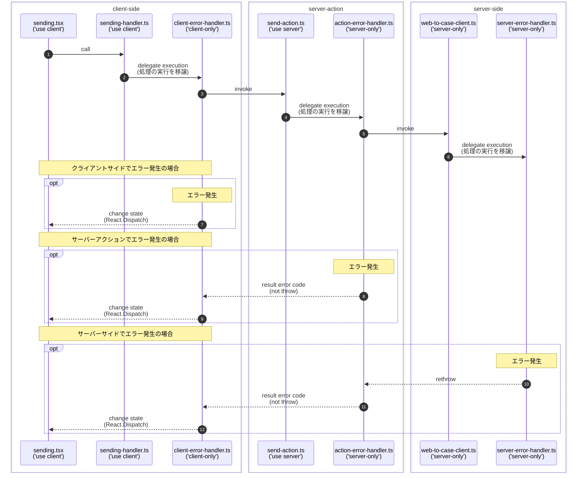

# ポートフォリオ
Next.js の実装集

## :open_book: 目次

1. [フロントエンドアーキテクチャ考察](#thinking-フロントエンドアーキテクチャ考察)
2. 簡単なアプリケーション
    * [対話型AIインターフェース](#robot-対話型AIインターフェース)
    * [お問い合わせフォーム](#envelope-お問い合わせフォーム)
4. アプリミドル基盤
    * [バリデーターインターフェース](#heavy_check_mark-バリデーターインターフェース)
    * [ロギング](#footprints-ロギング)
    * [エラーハンドリング](#boom-エラーハンドリング)
    * [ユーティリティ型](#hammer_and_wrench-ユーティリティ型)
6. テスト＆モック
    * [node:test](#nodetest)
    * [next:jest](#nextjest)
    * [バックエンドAPIのモック](#バックエンドAPIのモック)

***

Next.jsアプリケーションを実装する際の指針

## :thinking: フロントエンドアーキテクチャ考察

フロントエンドはMVVM構成とし、各構成要素であるModel、View、ViewModelを以下のように考える。

* View  
  .tsxをViewとする。コンポーネントを実装する。
* ViewModel  
  Viewに公開するもの(依存関係のあるもの)。Viewの状態や操作を実装する。
* Model  
  Viewに依存しない処理。上記以外のものはすべてここに分類する。
* 依存方向をView ⇒ ViewModel ⇒ Modelとする。

フォルダ構成を以下とする。
```text
.
├── app                        コンポーネント(.tsx)を格納する。
│   ├── (system)               共通のView
│   ├── chat                   業務アプリのView
│   └── contact                業務アプリのView
│
├── modules                    モジュール(.ts)を格納する。
│   ├── (system)               共通のモジュール
│   │
│   ├── chat                   業務アプリのモジュール
│   │   ├── models             業務アプリのモジュール(model)
│   │   └── view-models        業務アプリのモジュール(viewModel)
│   │
│   └── contact                業務アプリのモジュール
│        ├── models            業務アプリのモジュール(model)
│        └── view-models       業務アプリのモジュール(viewModel)
│
└── public
```

***

簡単なサンプルアプリケーション

## :robot: 対話型AIインターフェース

対話型AIに対して質問を入力すると、回答が一文字ずつリアルタイムに表示されます。  
対話型AIのAPIはモックを作成し、AIの回答を模した文字列を１文字ずつチャンク単位のストリーム形式でレスポンスしています。Next.jsのクライアントサイドでは、受信した文字列を順次差分レンダリングしています。

:open_file_folder: 画面サンプル：[_docs/chat/caht.gif](_docs/chat/caht.gif)  
:open_file_folder: コンポーネント：[app/chat/](app/chat)  
:open_file_folder: モジュール：[modules/chat/](modules/chat),  [app/api/chat/](app/api/chat)  
:open_file_folder: AIモック：[__mocks__/openai-mock.mts](__mocks__/openai-mock.mts)  
:open_file_folder: シーケンス図：[_docs/chat/sequenceDiagram.md](_docs/chat/sequenceDiagram.md)  

***

## :envelope: お問い合わせフォーム

入力されたお問い合わせを、SalesforceのWeb-to-Caseに送信します。  

useStateを使用した実装例。入力フォームに項目が少ない場合は、この実装が簡単です。

:open_file_folder: 画面サンプル：[_docs/contact/contact.gif](_docs/contact/contact.gif)  
:open_file_folder: コンポーネント：[app/contact/](app/contact)  
:open_file_folder: モジュール：[modules/contact/](modules/contact)  


useReducerを使用した実装例。状態管理ロジックをreducer関数としてモデルに分離しています。UIとモデルの切り分けがより明確になっています。MVVM（Model-View-ViewModel）パターンに基づいた構成です。

:open_file_folder: コンポーネント：[app/contact2/](app/contact2)  
:open_file_folder: モジュール：[modules/contact2/](modules/contact2)  

***

アプリケーションの実装を統一し、一貫性を持たせるための共通設計

## :heavy_check_mark: バリデーション
#### バリデーションインターフェース
アプリケーションがバリデーションの実装に強く依存しない設計にしています。実装にはZodなどのライブラリや、独自の実装を使用できます。

:open_file_folder: コード：[modules/(system)/validators/validator.ts](modules/(system)/validators/validator.ts)  
:open_file_folder: 使用例：[modules/contact/model.ts#L29](modules/contact/model.ts#L29)

***

## :footprints: ロギング
#### winstonロガー
`winston` を用いたログ出力の設定例です。ログローテーションも行います。  

:open_file_folder: コード：[modules/(system)/loggers/logger-winston.ts](modules/(system)/loggers/logger-winston.ts)  

#### ロギングファサード風

`Java` の `SLF4j` 風のロギングファサードです。統一されたロギングインターフェースを提供し、アプリケーションがロギングライブラリに直接的に依存しないように設計しています。
`winston` をロギング実装として読み込みしています。  
後からロギングライブラリを変更したくなった際に、最小限の修正で済みます。

:open_file_folder: コード：[modules/(system)/logging-facade/](modules/(system)/logging-facade/)  
:pencil: 使用例
```ts
import logger from '@/modules/(system)/logging-facade/logger';
...
logger.info('ログメッセージ');
```

#### デバッグログ

`console.log()` を使用したデバッグログ出力機能を提供します。
- 開発モード `development` の場合に、 `console.log()` でログ出力します。
- 本番モード `production` の場合は、ロガーに空実装を適用することでログ出力を無効化します。

開発中はデバッグログを出力し、本番環境ではログ出力を防ぎます。

このモジュールが最初にインポートされたときにファクトリ関数が実行され、ロガーの実装が決定します。  
以降はキャッシュされたロガーを再利用するため効率的です。

:open_file_folder: コード：[logger-debug.ts](modules/(system)/loggers/logger-debug.ts)  
:pencil: 使用例
```ts
import debug from '@/modules/(system)/loggers/logger-debug';
...
debug('ログメッセージ');
```

***

## :boom: エラーハンドリング
エラーハンドリングの実装を統一し、一貫性を持たせます。javascriptの関数を引数にとれる性質と、クロージャを活用しています。

#### サーバーサイドエラーハンドリング
例外をキャッチして再スローします。  
この例外が処理されなければ、Next.jsは未処理の例外として処理し、標準のエラーページ(error.tsx)をレンダリングします。

:open_file_folder: コード：[modules/(system)/error-handlers/server-error-handler.ts](modules/(system)/error-handlers/server-error-handler.ts)  
:open_file_folder: 使用例：[app/contact/page.tsx#L16](app/contact/page.tsx#L16)  

#### サーバーアクションエラーハンドリング

サーバーアクションはHTTPエンドポイントとして実行されるため、サーバーアクション内で例外をスローしても、呼び元にそのまま伝播しない。シリアライズ可能なオブジェクトの形式で、戻り値として返却する必要があると考える。

例外をキャッチして戻り値にステータスフラグ(ERROR)を返し、呼び元はフラグを見てエラーハンドリングを行う設計とした。

:open_file_folder: コード：[modules/(system)/error-handlers/action-error-handler.ts](modules/(system)/error-handlers/action-error-handler.ts)  
:open_file_folder: 使用例：[app/contact/sending.tsx](app/contact/sending.tsx)  

#### クライアントサイドエラーハントリング
例外をキャッチしたら、Reactのフックを使ってクライアントサイドでエラーページに遷移させています。

クライアントサイドの例外ハンドリングは、少し工夫が必要でした。
クライアントサイドで例外がスローされても、Next.jsがそれをキャッチして標準のエラーページ(error.tsx)をレンダリングしないケースがあるため、このように自力でエラーページに遷移させる方法を考えました。

:open_file_folder: コード：[modules/(system)/error-handlers/client-error-handler.ts](modules/(system)/error-handlers/client-error-handler.ts)  
:open_file_folder: 使用例：[app/contact/sending.tsx#L22](app/contact/sending.tsx#L22)  

#### エラーハンドリングシーケンス
クライアントサイドからサーバーアクションを経由してサーバーサイド処理を呼ぶ場合の各層のエラーハンドリング概要  


***

## :hammer_and_wrench: ユーティリティ型
汎用的に利用できる型エイリアス

#### クエリパラメーターの型エイリアス

型エイリアスを用意しておくことで、アプリケーション内でクエリパラメーターを扱いやすくなります。

Next.js15から、クエリパラメーターは非同期で取得されるようになりました。`Promise` にラップされるため、 `await` を用いてその値を取得する必要があります。

:open_file_folder: コード：[search-params.ts](modules/(system)/types/search-params.ts)  
:open_file_folder: 使用例：[app/contact/page.tsx#L19](app/contact/page.tsx#L19)

#### フォーム入力値を保持する汎用マップ型

:open_file_folder: コード：[form-data.ts](modules/(system)/types/form-data.ts)  
:pencil: 使用例：キー名をリテラルのユニオンで作成し、型パラメータに渡します。
```ts
type FormKeys = 'name' | 'email' | 'body';
...
const [formData, setFormData] = useState<FormData<FormKeys>>({
	name: '',
	email: '',
	body: '',
});
```
プロパティ名の正当性は静的に担保されます。入力候補も効くようになり扱いやすくなります。
```html
<input type="text" value={formData.name} ... />
<input type="text" value={formData.email} ... />
<input type="text" value={formData.body} ... />
```


***

テストフレームワークや開発中に使用するモックなど

## :performing_arts: テスト＆モック

#### node:test
Node.js 組み込みのテストランナー。手軽に利用できるが、Next.js環境外で動作するため `import server-only` などはエラーとなってしまう。
ただしモックが利用できるので、`server-only`をモックすれば動作できる。

:open_file_folder: コード：[node-test/](__tests__/node-test/)

#### next:jest
Next.js用のJest構成。`import server-only`も動作できる。

:open_file_folder: コード：[next-jest/](__tests__/next-jest/)

#### バックエンドAPIのモック
ExpressでバックエンドAPIのモックを作成した。package.jsonにscriptを定義し、`npm run dev:mock` のコマンドで、アプリケーションとモックが一緒に起動できるようにしている。
バックエンドに依存することなく開発を進めることができる。

:open_file_folder: コード：[__mocks__/](__mocks__)


