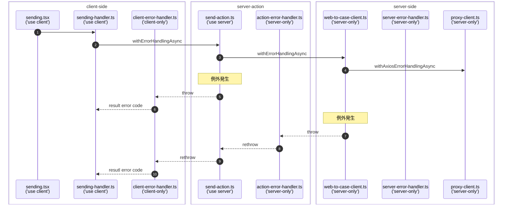

```mermaid

sequenceDiagram
autonumber

box client-side
  participant S as sending.tsx<br>('use client')
  participant SH as sending-handler.ts<br>('use client')
  participant CEH as client-error-handler.ts<br>('client-only')
end

box server-action
  participant SA as send-action.ts<br>('use server')
  participant AEH as action-error-handler.ts<br>('server-only')
end

box server-side
  participant WCC as web-to-case-client.ts<br>('server-only')
  participant SEH as server-error-handler.ts<br>('server-only')
  participant PC as proxy-client.ts<br>('server-only')
end

S->>SH: 
SH->>SA: withErrorHandlingAsync
SA->>WCC: withErrorHandlingAsync
WCC->>PC: withAxiosErrorHandlingAsync

Note over SA: 例外発生
SA-->>CEH: throw
CEH-->>SH: result error code

Note over WCC: 例外発生
WCC-->>AEH: throw
AEH-->>SA: rethrow
SA-->>CEH: rethrow
CEH-->>SH: resutl error code

```
