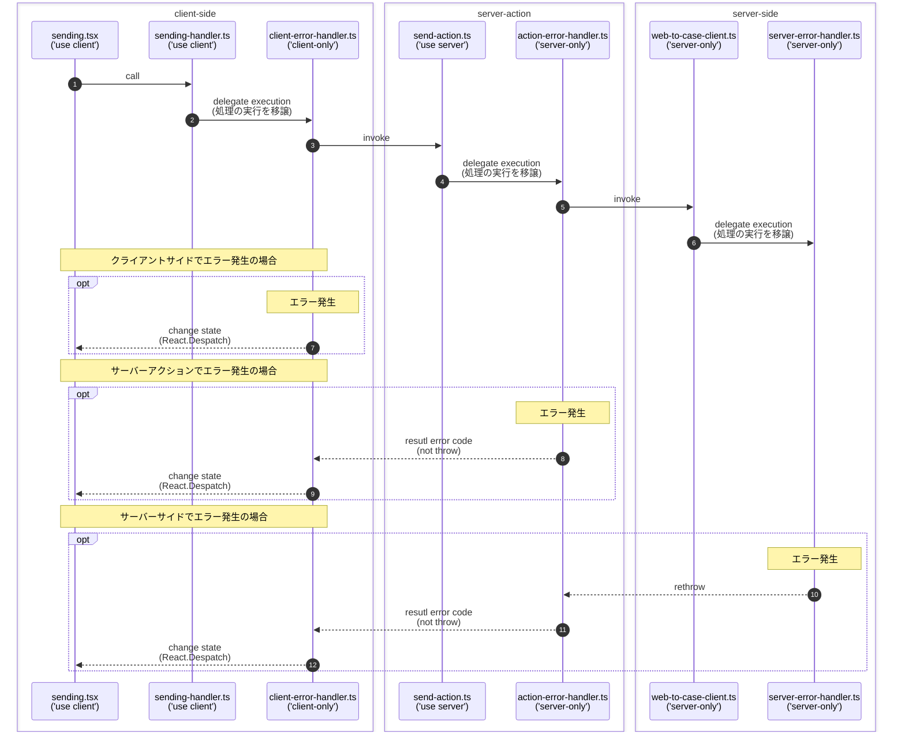

```mermaid
sequenceDiagram
autonumber

box client-side
  participant S as sending.tsx<br>('use client')
  participant SH as sending-handler.ts<br>('use client')
  participant CEH as client-error-handler.ts<br>('client-only')
end

box server-action
  participant SA as send-action.ts<br>('use server')
  participant AEH as action-error-handler.ts<br>('server-only')
end

box server-side
  participant WCC as web-to-case-client.ts<br>('server-only')
  participant SEH as server-error-handler.ts<br>('server-only')
end

S->>SH: call
SH->>CEH: delegate execution<br>(処理の実行を移譲)
CEH->>SA: invoke
SA->>AEH: delegate execution<br>(処理の実行を移譲)
AEH->>WCC: invoke
WCC->>SEH: delegate execution<br>(処理の実行を移譲)

Note over S,CEH: クライアントサイドでエラー発生の場合
opt
  Note over CEH: エラー発生
  CEH-->>S: change state<br>(React.Despatch)
end

Note over S,CEH: サーバーアクションでエラー発生の場合
opt
  Note over AEH: エラー発生
  AEH-->>CEH: resutl error code<br>(not throw)
  CEH-->>S: change state<br>(React.Despatch)
end

Note over S,CEH: サーバーサイドでエラー発生の場合
opt
  Note over SEH: エラー発生
  SEH-->>AEH: rethrow
  AEH-->>CEH: resutl error code<br>(not throw)
  CEH-->>S: change state<br>(React.Despatch)
end
```
